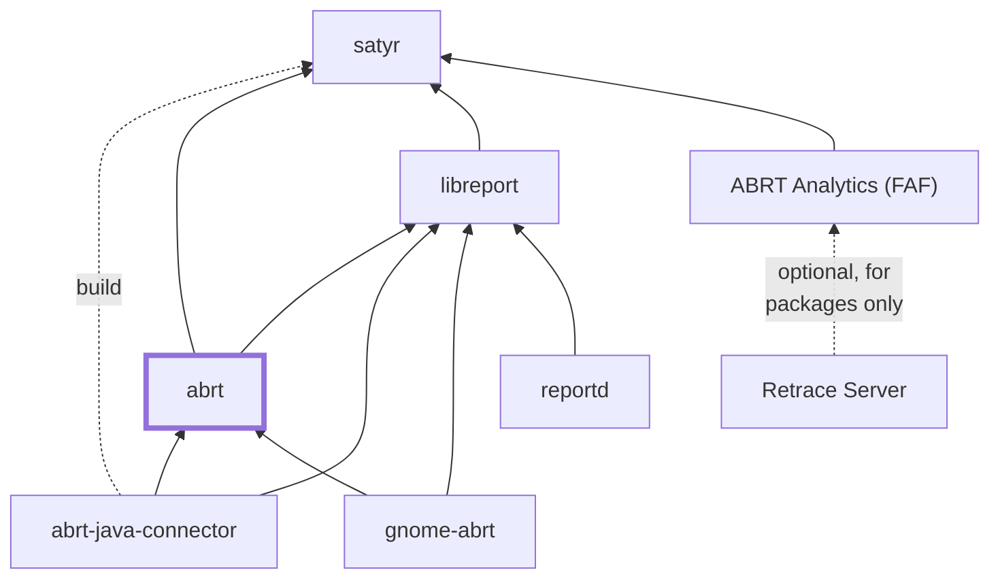

# ABRT

**A set of tools to help users detect and report application crashes.**

### About

Its main purpose is to ease the process of reporting an issue and finding a
solution.

The solution in this context might be a bugzilla ticket, knowledge base article
or a suggestion to update a package to a version containing a fix.

This repository is one among a suite of related projects. The following diagram
summarizes the dependencies between the individual packages comprising the ABRT
suite.

### Documentation

Every ABRT program and configuration file has a man page describing it. It is
also possible to [read the ABRT documentation](http://abrt.readthedocs.org/)
online. For contributors and developers, there are also [wiki
pages](https://github.com/abrt/abrt/wiki) describing some topics to deeper
technical details.

### Development

 * IRC Channel: #abrt on [irc.libera.chat](https://libera.chat/)
 * [Mailing List](https://lists.fedorahosted.org/admin/lists/crash-catcher.lists.fedorahosted.org/)
 * [Bug Reports and RFEs](https://github.com/abrt/abrt/issues)
 * [Contributing to ABRT](CONTRIBUTING.md)
 * [Install and run ABRT](INSTALL.md)

### Running

ABRT consist of several services and many small utilities. While The utilities
can be successfully run from the source directories after build, the services
often uses the utilities to do actions and expect the utilities installed in
the system directories. Hence to run the services, it is recommended to install
ABRT first and run them as system services. The instructions how to build
and install ABRT can be found in [INSTALL.md](INSTALL.md)

### Technologies

* [libreport](https://github.com/abrt/libreport) - problem data format, reporting
* [satyr](https://github.com/abrt/satyr) - backtrace processing, micro-reports
* [Python3](https://www.python.org/)
* [GLib2](https://developer.gnome.org/glib/)
* [Gtk3](https://developer.gnome.org/gtk3)
* [D-Bus](https://www.freedesktop.org/wiki/Software/dbus/)
* [SELinux](https://github.com/SELinuxProject/selinux/wiki)
* [systemd](https://www.freedesktop.org/wiki/Software/systemd/)
